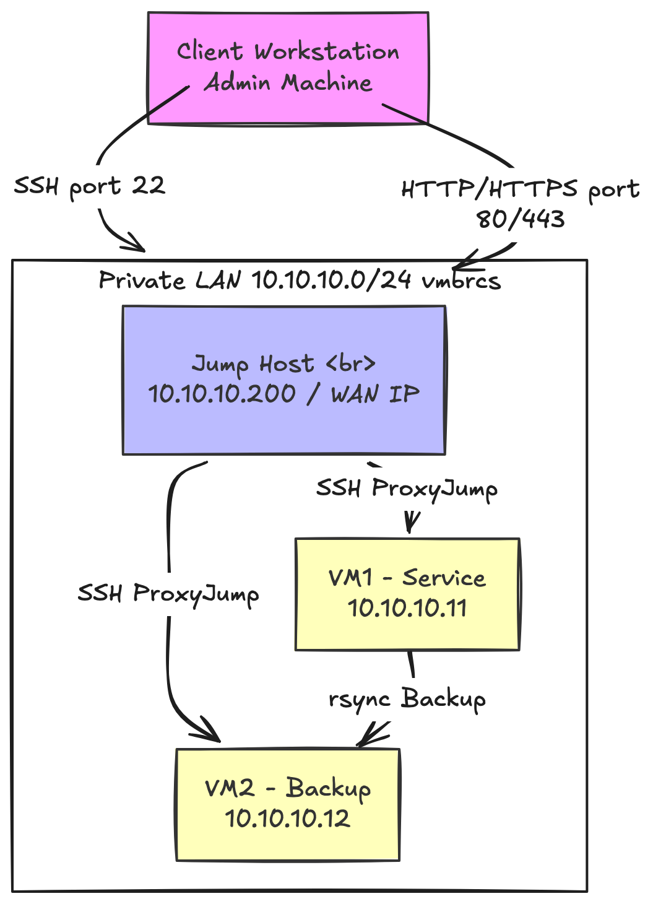

# Báo Cáo Triển Khai Hạ Tầng & Mạng

## Dự án Capstone - Hệ điều hành Linux & Ứng dụng

**Thành viên phụ trách:** Nguyễn Lê Gia Phú (Hạ tầng & Mạng)

---

## 1. Thiết Kế Tổng Quan Hệ Thống

Hệ thống được thiết kế theo kiến trúc phân vùng mạng bảo mật (Private LAN) kết hợp với cơ chế truy cập từ xa an toàn qua Jump Host (Bastion). Toàn bộ hạ tầng được triển khai trên nền tảng ảo hóa **Proxmox Virtual Environment (PVE)** với 3 Máy ảo (VM) chạy hệ điều hành **Ubuntu 22.04.5 LTS Server**.

### Sơ đồ kiến trúc kết nối:



### Danh sách các máy ảo trên node Proxmox (PVE):

Các máy ảo được khởi tạo và chạy đồng thời trên Proxmox với vai trò riêng biệt:

- **200 (jump-host)**: Jump Host làm cổng trung chuyển để admin SSH/truy cập từ xa.
- **202 (vm2-backup)**: Máy chủ nhận và lưu trữ bản sao lưu chuyên dụng.
- **203 (vm1-svc)**: Máy chủ dịch vụ chính chạy Nginx Web Server, Backend App và MySQL Database.


---

## 2. Thiết Kế và Cấu Hình Mạng (Networking)

Hạ tầng mạng ảo hóa được chia làm hai phân vùng riêng biệt trên Proxmox để đảm bảo tính an toàn thông tin:

1. **Mạng ngoài (External/WAN) - Bridge `vmbr0`**:
   - Được ánh xạ trực tiếp tới cổng mạng vật lý `nic0` của máy chủ vật lý PVE.
   - Cung cấp IP mạng ngoài cho Jump Host (nhận qua Bridge) để quản trị viên có thể kết nối từ máy cá nhân.
2. **Mạng LAN nội bộ (Private LAN) - Bridge `vmbrcs`**:
   - Là một Switch ảo cô lập hoàn toàn (không gán cổng mạng vật lý).
   - Sử dụng dải IP nội bộ: `10.10.10.0/24`.
   - Cổng Gateway ảo trên Host PVE được cấu hình IP: `10.10.10.1`.
   - Các VM dịch vụ (`vm1-svc`) và sao lưu (`vm2-backup`) chỉ kết nối vào card mạng nội bộ này, cô lập hoàn toàn với Internet bên ngoài nhằm tránh các cuộc tấn công trực tiếp.

### Cấu hình các Bridge trên Proxmox:

- **Mạng LAN nội bộ riêng tư (`vmbrcs`):**
  Subnet `10.10.10.1/24` được sử dụng để kết nối các máy ảo trong mạng LAN bảo mật.

  

- **Mạng LAN ngoài vật lý (`vmbr0`):**
  Cầu nối trực tiếp đến cổng vật lý `nic0`.

  

### Bảng Phân Bổ IP Hệ Thống:

| Tên VM     | Hostname     | IP WAN / Host Network          | IP Private LAN | Cổng Dịch Vụ Mở                  | Vai Trò                       |
| :--------- | :----------- | :----------------------------- | :------------- | :------------------------------- | :---------------------------- |
| **VM 200** | `jump-host`  | IP LAN ngoài (nhận từ `vmbr0`) | `10.10.10.200` | 22 (SSH)                         | Jump Host (Bastion)           |
| **VM 203** | `vm1-svc`    | Không có (Isolated)            | `10.10.10.11`  | 22 (SSH nội bộ), 80/443 (HTTP/S) | Backend Service & Web Host    |
| **VM 202** | `vm2-backup` | Không có (Isolated)            | `10.10.10.12`  | 22 (SSH nội bộ)                  | Backup Storage Replica Server |

---

## 3. Cấu Hình Phần Cứng & Lưu Trữ Của Các Máy Ảo

Để hệ thống vận hành tối ưu trên máy chủ tài nguyên giới hạn, cấu hình phần cứng của mỗi máy ảo được thiết lập chi tiết như sau:

### 3.1. Jump Host (`jump-host`)

- **Tài nguyên**: 1 vCPU, 1.00 GiB RAM, 20 GB Disk (scsi0) chứa OS.
- **Mạng (Dual NICs)**:
  - Card 1 (`net0`): Nối vào Bridge `vmbr0` để nhận IP ngoài.
  - Card 2 (`net1`): Nối vào Bridge nội bộ `vmbrcs` để giao tiếp với mạng LAN (IP `10.10.10.200`).

  

### 3.2. VM1 - Service Host (`vm1-svc`)

- **Tài nguyên**: 2 vCPUs, 2.00 GiB RAM.
- **Mạng**: 1 card mạng (`net0`) kết nối vào mạng nội bộ `vmbrcs` (IP tĩnh: `10.10.10.11`).
- **Lưu trữ (Dual Disks)**:
  - `scsi0` (20 GB): Chứa hệ điều hành Ubuntu Server.
  - `scsi1` (10 GB): Ổ đĩa dữ liệu chuyên dụng, được mount qua `/etc/fstab` vào hệ thống tại `/mnt/data` để lưu trữ ứng dụng và cơ sở dữ liệu MySQL. Thiết kế này giúp bảo vệ dữ liệu dự án độc lập với hệ điều hành khi cần nâng cấp hoặc cài lại hệ điều hành sạch.

  

### 3.3. VM2 - Backup Host (`vm2-backup`)

- **Tài nguyên**: 2 vCPUs, 2.00 GiB RAM.
- **Mạng**: 1 card mạng (`net0`) kết nối vào mạng nội bộ `vmbrcs` (IP tĩnh: `10.10.10.12`).
- **Lưu trữ (Dual Disks)**:
  - `scsi0` (20 GB): Chứa hệ điều hành Ubuntu Server.
  - `scsi1` (20 GB): Ổ đĩa dữ liệu backup chuyên dụng, được mount qua `/etc/fstab` tại `/mnt/backup` để lưu trữ các bản sao lưu đồng bộ từ VM1 gửi sang. Kích thước 20 GB đảm bảo lưu trữ nhiều phiên bản backup theo chính sách retention (lưu trữ và xoay vòng).

  

---

## 4. Giải Pháp Truy Cập Quản Trị Từ Xa (SSH ProxyJump)

Vì các máy ảo dịch vụ (`vm1-svc`) và sao lưu (`vm2-backup`) chỉ nằm trong mạng nội bộ riêng tư `vmbrcs`, quản trị viên không thể trực tiếp SSH từ máy Client bên ngoài vào chúng.

Để giải quyết bài toán này một cách an toàn và bảo mật, giải pháp **SSH ProxyJump** đã được cấu hình:

1. **Gia cố SSH**:
   - Tắt hoàn toàn việc đăng nhập bằng mật khẩu (`PasswordAuthentication no`) và tắt đăng nhập tài khoản root trực tiếp (`PermitRootLogin no`) trên tất cả các VM.
   - Chỉ cho phép đăng nhập qua khóa SSH bảo mật (SSH Key-based authentication).
2. **Khởi tạo và cấu hình Khóa SSH**:
   - Khóa SSH Ed25519 được tạo từ máy admin Client.
   - Public Key của admin được import vào `/home/sysadmin/.ssh/authorized_keys` và `/home/devops/.ssh/authorized_keys` trên các VM để xác thực.
3. **Lệnh SSH nhảy (ProxyJump)**:
   Để SSH trực tiếp vào máy chủ dịch vụ `vm1-svc` thông qua Jump Host, quản trị viên sử dụng lệnh:

   ```bash
   ssh -J sysadmin@<IP_JUMP_HOST_WAN> sysadmin@10.10.10.11
   ```

4. **Cấu hình SSH Client trên máy cá nhân (`~/.ssh/config`)**:
   Để đơn giản hóa thao tác làm việc hàng ngày, admin cấu hình file config trên máy Client như sau:
   ```text
   Host jump
       HostName <IP_JUMP_HOST_WAN>
       User sysadmin
       IdentityFile ~/.ssh/id_ed25519

   Host vm1-svc
       HostName 10.10.10.11
       User sysadmin
       ProxyJump jump
       IdentityFile ~/.ssh/id_ed25519

   Host vm2-backup
       HostName 10.10.10.12
       User sysadmin
       ProxyJump jump
       IdentityFile ~/.ssh/id_ed25519
   ```
   Sau khi lưu, quản trị viên chỉ cần thực hiện lệnh cực kỳ ngắn gọn:
   ```bash
   ssh vm1-svc
   # Hoặc
   ssh vm2-backup
   ```
   Hệ thống sẽ tự động thực hiện tiến trình ProxyJump (nhảy qua `jump-host`) một cách trong suốt (transparent).

---

## 5. Quy Trình Vận Hành Hạ Tầng & Sao Lưu

### 5.1. Mount ổ đĩa tự động tại khởi động

Các phân vùng lưu trữ riêng (`scsi1`) trên VM1 và VM2 được định dạng file system `ext4`. UUID của phân vùng được khai báo trong tệp `/etc/fstab` của từng VM để đảm bảo hệ thống tự động gắn kết (mount) ổ đĩa sau khi reboot:

- Trên VM1: Gắn vào `/mnt/data` làm phân vùng lưu trữ CSDL MySQL và mã nguồn ứng dụng.
- Trên VM2: Gắn vào `/mnt/backup` làm phân vùng lưu trữ các tệp tin backup nén.

### 5.2. Quy trình đồng bộ sao lưu an toàn

1. Định kỳ thông qua `cron` hoặc `systemd-timer`, một script tự động chạy trên `vm1-svc` để dump cơ sở dữ liệu (`mysqldump`) và nén mã nguồn ứng dụng Web thành tệp `.tar.gz` kèm dấu thời gian.
2. Tệp backup sau khi nén sẽ được chuyển an toàn sang máy chủ `vm2-backup` (`10.10.10.12`) thông qua công cụ `rsync` chạy trên giao thức SSH bảo mật.
3. Script sao lưu cũng thực thi chính sách tự động xóa các bản sao lưu cũ hơn 7 ngày trên cả máy chủ dịch vụ chính và máy chủ backup để tránh đầy dung lượng đĩa ảo.

```

```
